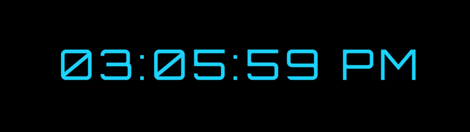

### JAVASCRIPT DIGITAL CLOCK

Building my own digital clock with JavaScript is a relatively easy small project to practice variables and simple if loops.

I have used some SASS to customize the design and make my JavaScript clock look fancy.

# Digital Clock App

## Table of Contents

### 1. About The Project
   **Digital clock app project**

- Built With
  - HTML;
  - SCSS;
  - JavaScript;
  - gh-pages;
  - npm live-server.

### 2. Getting Started

- Prerequisites
  - vsCode;
  - node modules;
  - package JSON.
- Installation
  - development tools:
    - node modules;
    - package.json;
    - package-lock.json;
    - gh-pages;
    - sass;
    - live-server.

### 3. Usage

- HTML;
- SCSS;
- JavaScript;
- Google fonts.

### 4. Roadmap
### 5. Contributing

## Iulian Stan

### 6. License
   Copyright protected
### 7. Contact
   [**Iulian Stan**](https://github.com/iulianSta)
### 8. Acknowledgement

### I want to thank to the [**DCI**](https://www.digitalcareerinstitute.org) team and teachers!
